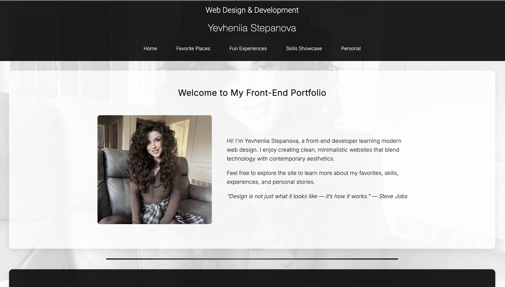
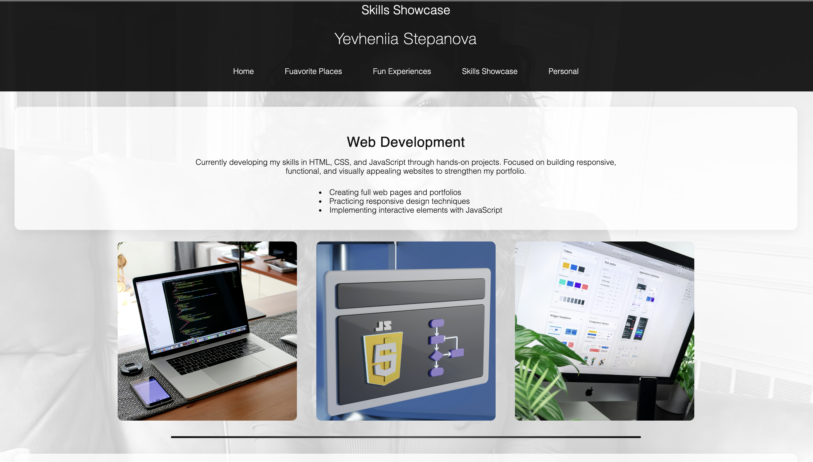
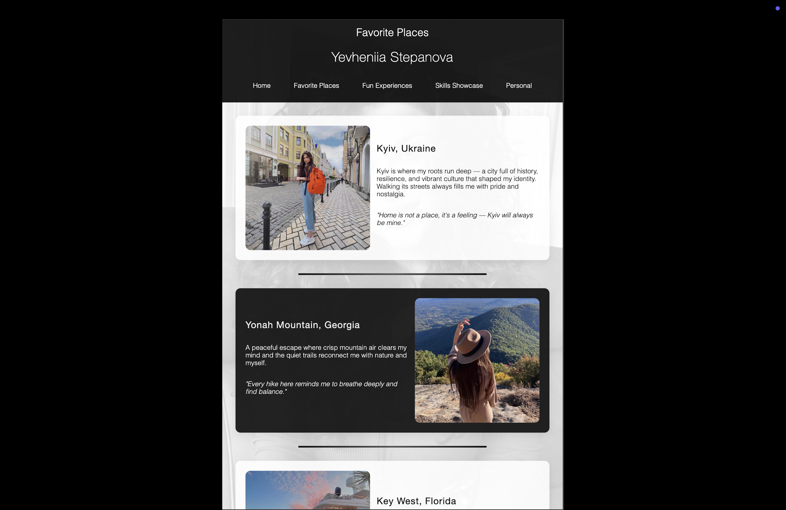
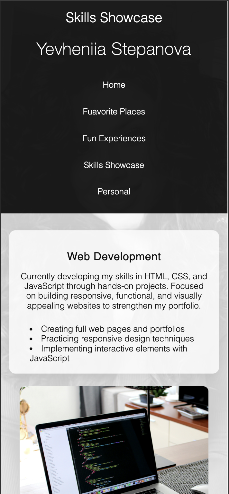

# Front-End Portfolio Website — HTML & CSS

A clean, multi-page front-end portfolio website built using **HTML5** and **CSS3**.  
The project focuses on semantic structure, visual clarity, and organized layout without relying on JavaScript frameworks.

This website presents personal information, skills, favorite places, experiences, and contact details through a consistent and minimal design approach.

---

## Live Preview

👉 https://yevheniiastepanova.netlify.app/index/?fbclid=PARlRTSANnJPhleHRuA2FlbQIxMAABpzvOCZZWJgssWKvqeYPeGCZBWZ4JUWJxl9VL7VoPXXbMA9-6hzLXjv_p-jjr_aem_jWLiuMomj1dbDR7hSy5PUg

---

## Screenshots


### Home — Desktop View


### Skills Showcase — Desktop View


### Favorite Places — Desktop View


### Skills Showcase — Mobile View



---

## Project Overview

This project is a personal front-end portfolio designed to demonstrate:
- semantic HTML structure,
- organized multi-page navigation,
- consistent styling across pages,
- and a content-first, minimal UI approach.

Each section of the website is separated into its own directory, making the project easy to maintain and understand.

---

## Pages Included

- **Home** — introduction and portfolio overview  
- **Favorite Places** — curated locations and inspirations  
- **Fun Experiences** — memorable activities and stories  
- **Skills Showcase** — presentation of front-end skills  
- **Personal** — personal background and notes  

All pages follow a unified layout and navigation structure.

---

## Features

- Semantic HTML5 markup  
- Clean, minimalistic UI design  
- Multi-page website structure  
- Page-specific CSS files  
- Responsive layout principles  
- Google Fonts integration  
- Footer with social media links  

---

## Tech Stack

- HTML5  
- CSS3  
- Google Fonts (Inter, Roboto)  

No JavaScript frameworks or libraries were used in this project.

---

## Project Structure

```text
MYWEBSITE/
├── index/
│   ├── images/
│   ├── index.html
│   └── styles.css
│
├── favorite/
│   ├── images/
│   ├── favorite.html
│   └── favorite.css
│
├── fun/
│   ├── images/
│   ├── fun.html
│   └── fun.css
│
├── good/
│   ├── images/
│   ├── good.html
│   └── good.css
│
├── personal/
│   ├── images/
│   ├── personal.html
│   └── personal.css
│
├── site/
│   └── styles.css
│
├── screenshots/
│   ├── home-desktop.png
│   ├── home-mobile.png
│   └── favorite-desktop.png
│
└── _redirects


Design Principles

Minimalism and clarity
Readable typography
Balanced spacing and layout
Consistent color usage
Content-first structure
Learning Goals
This project was created to practice:
writing semantic and accessible HTML
organizing multi-page websites
structuring CSS on a per-page basis
maintaining visual consistency without frameworks
building a professional front-end portfolio


Contact

You can reach me at:
📧 evgeniyalexandrovna94@gmail.com


License

This project is open for educational and portfolio purposes.